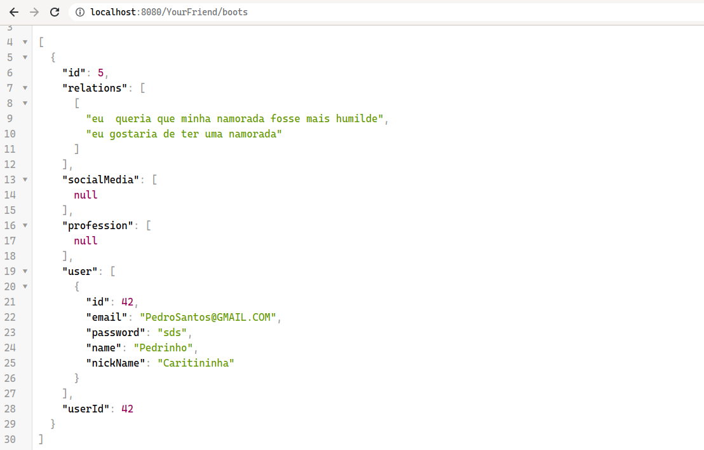
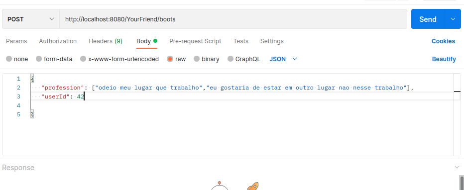

# Api-rest-Sprint-4

## API com JERSEY,JDBC,ORACLE

## /USERS
- Esse endpoint é responsável por consultar um usuário, editar, deletar e criar.

### GET
- Com /users, sem parâmetro algum e possível listar todos registrados na API. 

- Se passar o parâmetro  email, retorna uma lista com seu respectivo usuário.<br\>
Email e campo obrigatório é  unique no banco Oracle, então a ferramenta sera responsável por administrar, validações de email 
Com retorno do id, email, senha, nickName, password do respectivo usuário, consegue no front-end, facilmente validar os campos.

### POST
- Com o verbo post no endpoint users e possível criar um usuário, não precisa inserir o id, banco  sera responsável por validar esse campo<br\>
Os campos email, senha, nickanme, password são obrigatórios e not null, então precisa ser utilizado, caso a contrario gerara um erro interno no servidor da Oracle,
este erro vai ser mostrado apenas no terminal da API.
- Exemplo abaixo foi utilizado a ferramenta [postman](https://www.postman.com/downloads/)

### PUT
- Com o verbo put e possível editar o usuario, vale o mesmo conceito para o post,
- Precisa do id do usuário que deseja editar.
- Reforçando todos  os campos são obrigatórios, caso não inserir algum não sera atualizado.
- Exemplo do parâmetro id:  /users/2.  
- Caso não deseja atualizar todos os campos, coloque o valor anterior

### DELETE
- Apenas passando o parâmetro id e possível deletar o usuário.
- Id do usuário e uma chave estrangeira para boot, então ao deletar u usuário, automaticamente vai ser deletado qualquer frase inserida no campo do boot.
- Nossa relação e 1 para 1,então faz sentido deletar as frases inseridas pelo usuário, localizado na tabela boot ao ser deletado um usuário.
- Relação 1 para 1, nosso caso de uso. Não podemos possuir frases sem possuir usuários.

## /BOOT
- Nesse endpoint e possível inserir as frases e consultar quais estão registradas.

### GET
- Com /boots e possível consultar as frases registradas no banco.
- Recordando que o userId e a chave estrangeira.

### POST
- No banco nenhum campo na  tabela boots  são obrigatórios, exceto o user_id, este campo é a chave estrangeira, precisa ser o mesmo id da tabela users no campo id. Cocar os campos não serem obrigatórios pode fazer criacao  desta maneira

