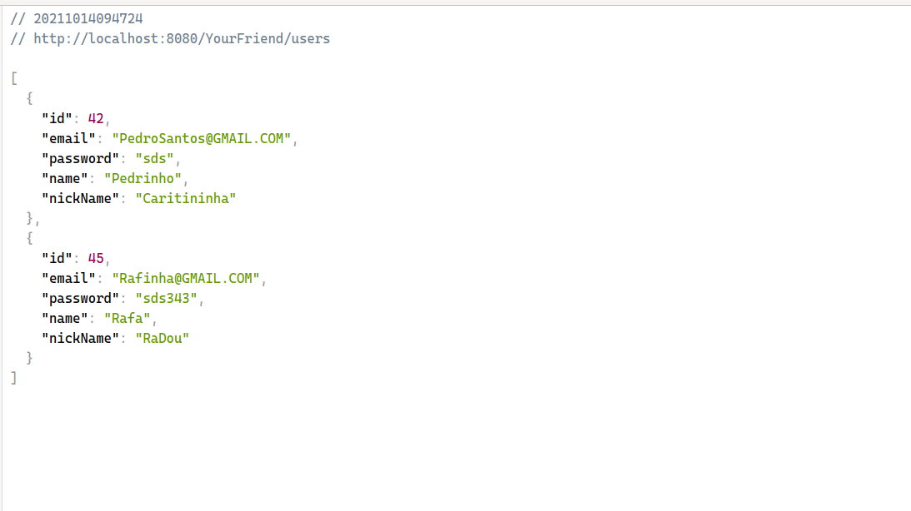
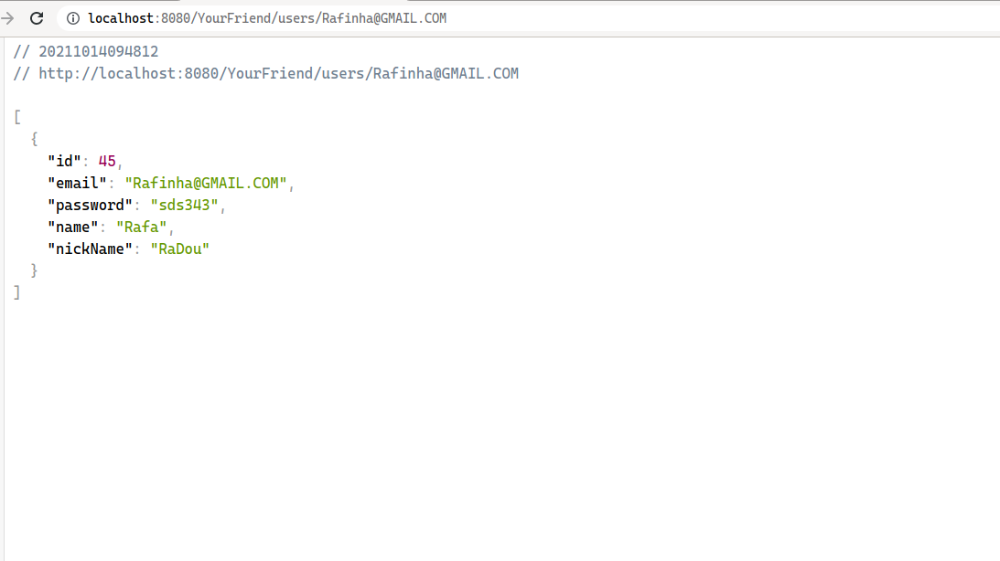
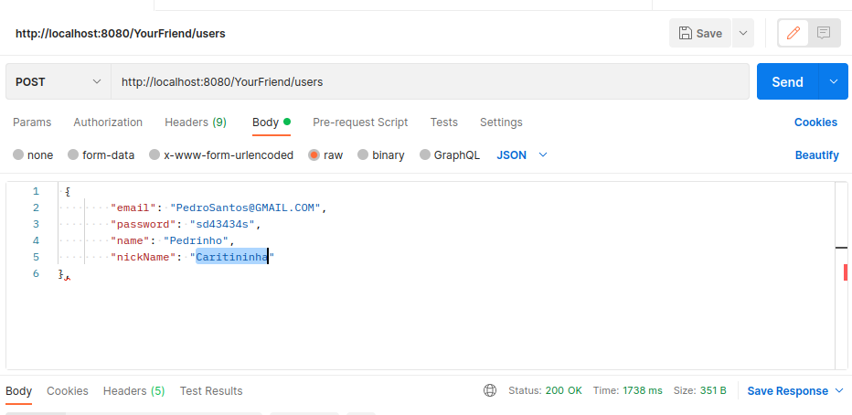

# Api-rest-Sprint-4

## API com JERSEY,JDBC,ORACLE

## /USERS
- Esse enpoint e reponsavel por consultar um usuario,editar,deletar e criar.

### GET
- Com /users, sem parametro algum e possivel listar todos regsitrados na api. 

- Se passar o parametro  email,retorna uma lista com seu respectivo usuario.<br\>
Email e campo obrigatorio e unique no banco Oracle,entao a ferramenta sera responsavel por adminsitrar,validacoes de email 
Com retorno do id,email,senha,nickName,password do respectivo usuario,consegue no front-end,facilmente validar os campos.

### POST
- Com o verbo post no endpoint users e possivel criar um usuario,nao precisa inserir o id,ferrametna do Oracle sera responsavel por validar esse campo<br\>
Os campos email,senha,nickanme,password sao obrigatorios e not null, entao precisa ser utilizado,caso acontrario gerara um erro interno no servidor da Oracle,
este erro vai ser mostrado apenas no terminal da API.
- Exemplo abaixo foi utilizado a ferramenta [postman](https://www.postman.com/downloads/)

### PUT
- Com o verbo put e possivel editar o usuario,vale os mesmo conceito para o post,
- Precisa do id do usuario que deseja editar.
- Reforncando todos  os campos sao obrigatorios,caso nao inserir algum nao sera ataulizado
- Exemplo do parametro id:  /users/2.  

### DELETE
- Apenas passando o parametro id e possivel deletar o usuario
- Id do usuario e uma chave estrageira para boot, entao ao deletar u usuario,automaticamente vai ser deletado qualquer frase inserado no campo do boot
- Nossa relacao e 1 para 1,entao faz sentido deletar as frases inseridas pelo usuario,localizado na tabela boot ao ser deletado um usuario. 
- Relacao 1 para 1, nosso caso de uso. Nao podemos possuir frases sem possuir usuarios.

